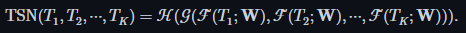
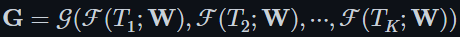
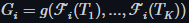
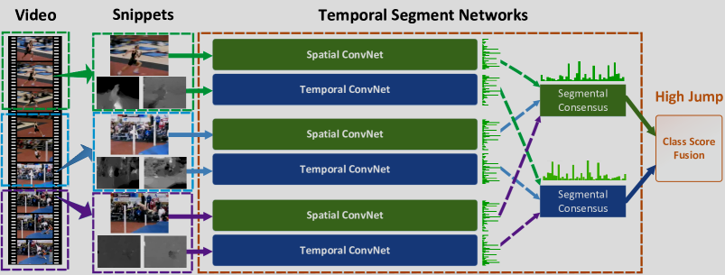

# Temporal Segment Networks: Towards Good Practices for Deep Action Recognition
## 目标
1. 捕捉长距离时间视频表示
2. 在有限训练样本学习卷积神经网络
## TSN(temporal segment network)
1. 对视频划分为时间相等的片段 S1 到 Sk 。
2. 对片段 {$ S_{1} $，$ S_{2} $，...，$ S_{k} $} 随机采样几帧得到 {$ T_{1} $，$ T_{2} $，...，$ T_{k} $} ，其中$ T_{k} $∈$ S_{k} $。
3. 公式如下 

    

4.  ℋ：softmax，即 ℋ(G) = Softmax(G)

    𝒢：segmental consensus function（分段共识），聚合多个 snippet 的输出，得到整段视频的 一致性特征表示

    ℱ：CNN提取特征

    注意，

    而 ，最后 $ G_{i} $ 输出一个分数

    g：aggregation function，使用平均融合上一步的结果，并使用加权1：1.5融合空间和时间结果。

    G=[$ G_{1} $，$ G_{2} $，...，$ G_{k} $]

    最后 ℋ(G) = Softmax(G) 实现分类

5.TSN 在原始双流网络基础上，引入了两种新的输入模态：
RGB 差分图（RGB difference）和扭曲光流（warped optical flow）

RBG difference描述了连续2帧的差别，即相邻帧 RGB 差值图

warped optical flow fields：去除相机运动的光流图

## 

空间流处理RGB，时间流处理光流，输入给对应的segmental consensus，然后分别对结果取平均得到结果。最后将结果加权平均实现分类。
#

# Conclusion

Two-Stream 网络 将视频动作识别分为空间流和时间流，有效捕捉静态和动态特征，但存在建模时序范围短、结构较浅的问题。

Temporal Segment Networks (TSN) 是在其基础上的改进方法：

引入稀疏时间采样策略，实现对视频长时依赖的建模，降低计算成本

使用更深的 BN-Inception 网络结构，提升表达能力

增加 RGB 差分图 和 Warped 光流图 输入，增强动作区域判别力

TSN 在准确率和效率之间取得了良好平衡，是视频动作识别领域的一个重要进展

