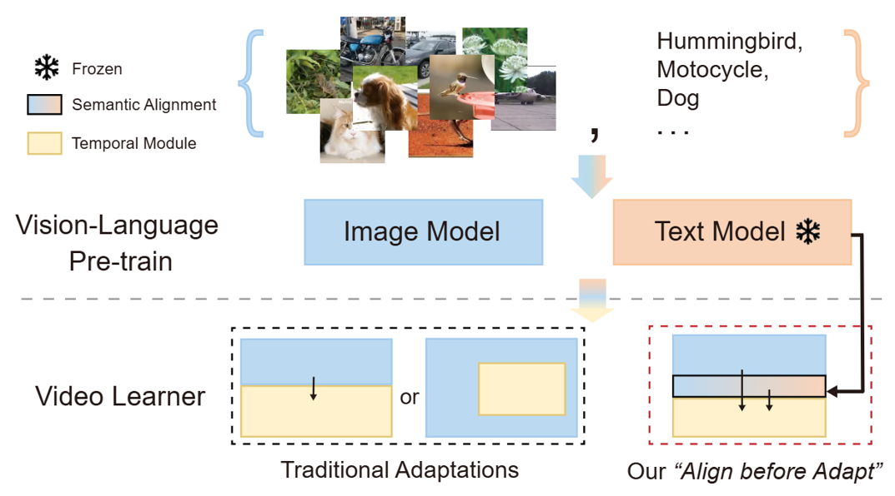
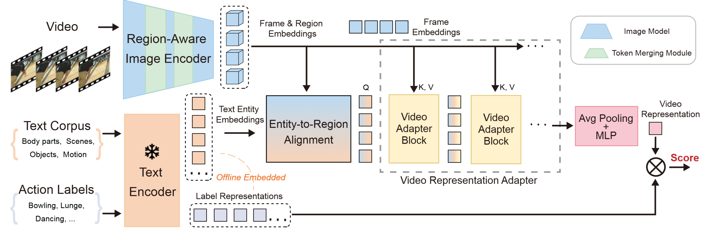
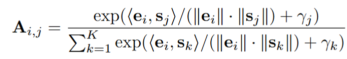
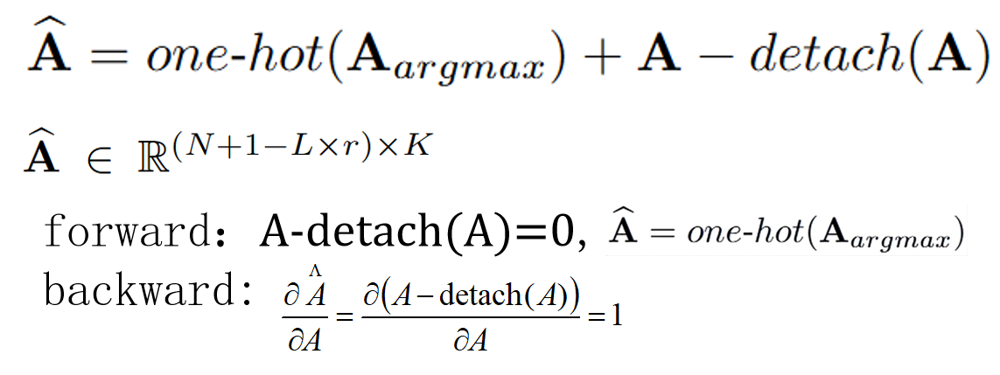
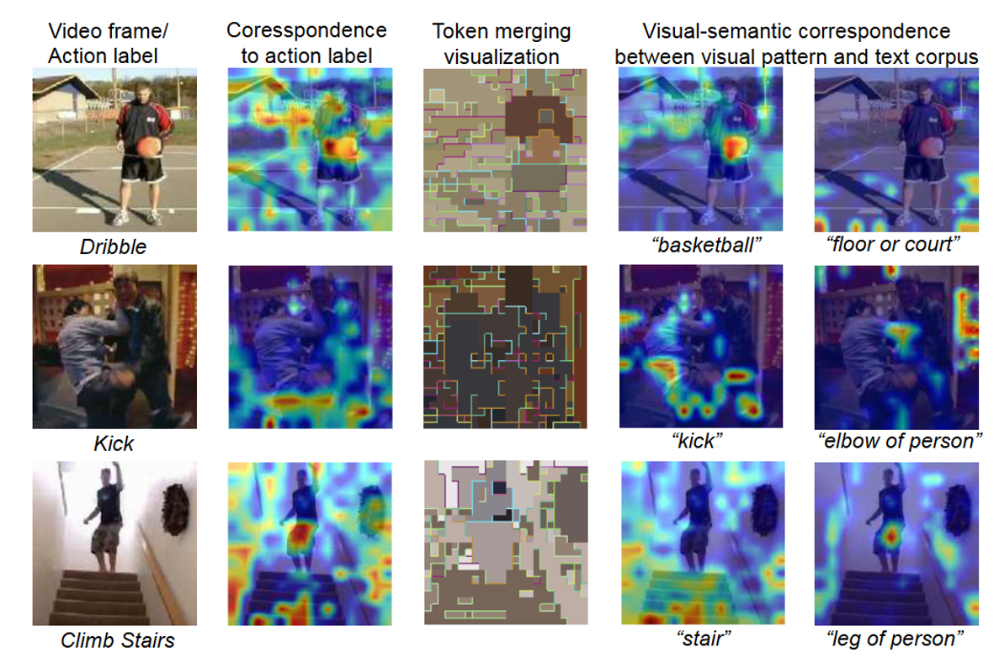
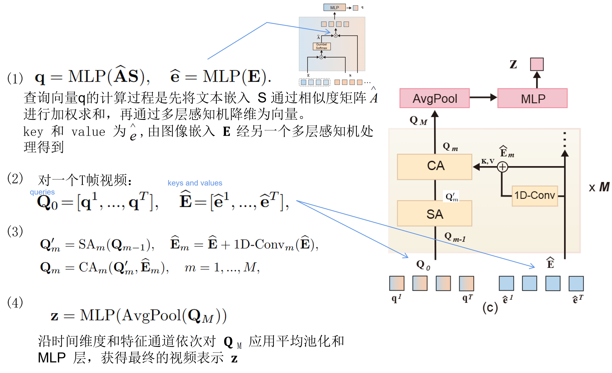

# Align before Adapt: Leveraging Entity-to-Region Alignments for Generalizable Video Action Recognition
先对齐后适配(ALT)：利用实体-区域对齐实现可泛化视频动作识别

## Introduction

与"adapt then align"方法 将图像级视觉嵌入与动作名称的文本嵌入对齐不同,ALT 旨在建立实体级对应关系以支持动作识别。

先用VLP(visual-language pre-trained)模型在每帧中对齐实体与区域，再用这些实体文本作为“查询”，通过Transformer提取视频关键语义。这样既保留了预训练模型的语义理解能力，又让动作识别更具可解释性和泛化性。

### 传统适配方法与我们提出的“先对齐后适配”（Align before Adapt）方法之间的范式对比。

#

## Contribution

1. 提出“先对齐后适配”范式，利用实体-区域对应关系指导从视觉语言预训练到动作识别的适配过程。该范式在视频表征适配过程中保持视觉语言预训练模型的视觉-语言对齐特性，从而实现更好的可解释性与泛化能力。

2. 我们提出了一种基于 Transformer 的新型视频适配器，用于将视频中最重要实体的语义提取为向量。该适配器采用基于 Transformer 的架构，利用选定实体的文本嵌入作为查询，多帧视觉嵌入作为键和值。

3. 我们在多种学习配置下进行了广泛实验。除了以较低计算复杂度展现出具有竞争力的性能（在相同 VLP 骨干网络下，以 55% 更少的 GFLOPs 需求，超越当前领先方法 0.4% 的 Top-1 准确率），我们的方法由于可复用文本实体而展现出卓越的泛化能力（超越先前最优方法超过 10%）。

# An overview of our framework
    我们利用视频剪辑和离线文本语料库作为输入来学习视频表示 ，该视频表示受到监督，目的是最大化与相应动作标签的文本表示的相似度得分。

首先是：
上半部分：视频输入 通过图像编码器，这一步用到了token 合并方法，最后输出每个帧生成的一组区域特征嵌入
下半部分：构建一个文本语料库，输入到clip的文本编码器得到文本嵌入。

之后 在实体-区域对其模块，计算两者的相似度，得到一个相似度矩阵，A^S加权求和后是得到每个区域对应的最相似实体的嵌入表示。再之后经过MLP后，得到查询向量Q。
然后把图像嵌入 E 经另一个MLP得到key 和 value，与Q做Cross attention计算，最后输出视频表示Z，
之后与动作标签嵌入做相似度匹配。

## 1.Text corpus of action-related entities. 构建动作相关实体语料库

1. 对动作名做 词性标注，提取候选实体。
通过 LLM 提示 扩展与动作强相关的对象、场景(kinetics、HMDB、UCF收集一组动作标签)

2. 用 WordNet、LLM 为每个实体生成描述集合。

3. 采用词义消歧技术（包括 Lesk 算法和 T5 语言模型）过滤实体与动作无关的描述。默认将头部、脚部等身体部位纳入语料库，因其涉及大多数人类活动。

最终得到一个实体文本库 S ={s_i}，  然后通过 文本编码器 得到 向量.{s_i}={unit_i,description_i}

### 具体细节及所用提示词：
(1) 我们通过两种方法"提取"相关动作单元：使用 NLTK 和 spaCy 词性标注工具进行名词及短语实体提取；以及通过 ChatGPT 设计提示模板"What are identifying visual characteristics, such as object, body parts, scenes, and roles, of a/an {label} video action? List them concisely."。

(2) 利用 WordNet 工具为每个提取的单词单元生成解释性描述序列。对于提取的短语单元，我们通过以下提示模板要求 ChatGPT 生成解释性描述："Concisely describe what a/an {phrase unit} looks like"、"Concisely list potential explanations for {phrase unit}"、"Concisely explain {phrase unit} in one sentence"。

(3) 为确定每个单元最合适的描述，我们根据动作标签采用 Lesk 算法和基于 T5 的词义消歧模型。所有流程均通过代码自动完成。

## 2.区域感知的图像嵌入 Region-aware Image Embeddings

1. 把视频的帧 输入给CLIP-ViT 模型，得到一系列 嵌入 E_0=[e_cls,0,e_1,0,e_2,0,...,e_N,0] + E_pos

2. 然后使用 Token 合并（Token Merging）技术，把语义相似的 patch 合并成一个。

改进后的 Transformer 块前向传播过程可表述为 E_l=BLOCK_ToMe(E_l-1)

最后得到 E = [e_cls,e-1,...,e_N-L×r].

## 3.Entity-to-regions alignments 实体到区域的对齐

1. 为了把 视觉 patch 向量 与 文本实体向量 对齐，用Gumbel-Softmax先计算两者之间的相似度矩阵𝐴,即每个区域与每个实体的匹配分数
    

2. 由于一个区域可能和多个实体相似度接近，为了得到语义明确、可解释的对齐结果，（每个区域只匹配一个实体）作者使用了 “differentiable one-hot trick”为每个区域突出显示最相似的实体
    

其中 detach 用于阻断梯度回传

#

第(2)列可视化与动作标签生成的文本实体对应的视觉区域

第(3)列展示 ToMe 下的区域感知嵌入

第(4)和第(5)列显示与特定文本实体对应的两种细粒度视觉模式，这些模式与第(3)列在几何上保持一致。

## 4.Video Representation Adapter 视频表征适配器

## Conculsion
本文提出了一种采用"先对齐后适配"范式的新型视频动作识别方法。

通过利用局部视觉外观与动作相关实体语义之间的对齐关系，我们实现了具有更好可解释性和泛化能力的视频表征适配。

该方法在保持低计算成本的同时，尤其在零样本和少样本场景中展现出卓越性能。
