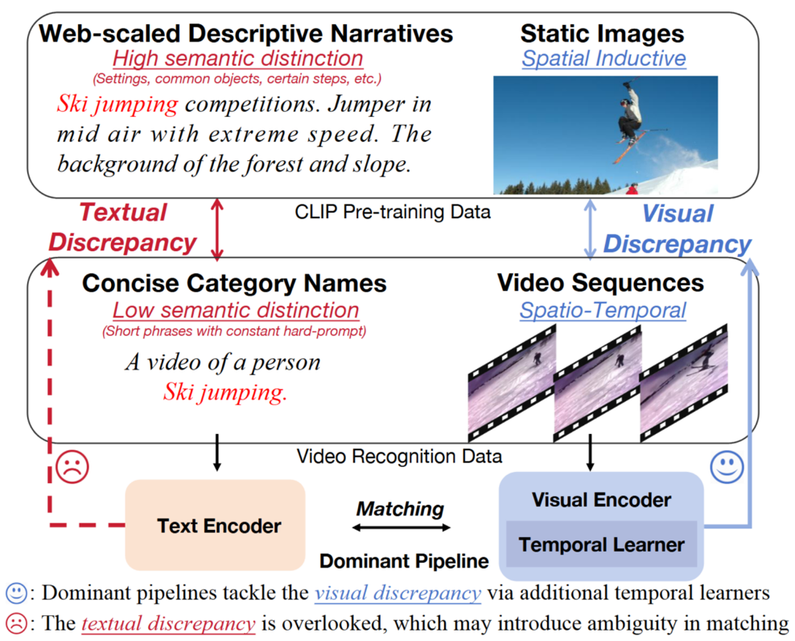
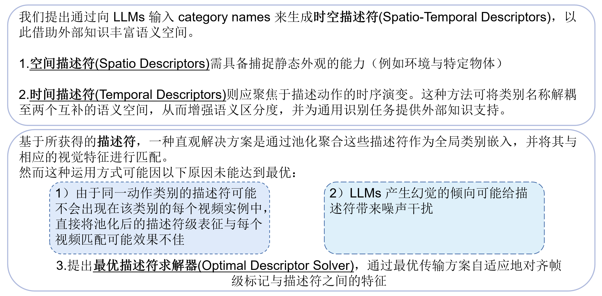
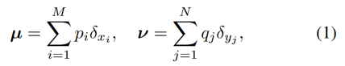
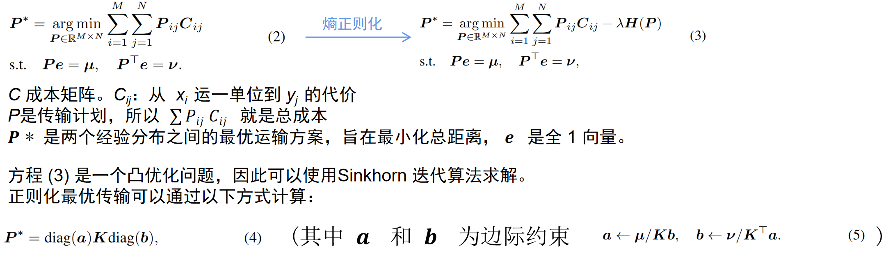
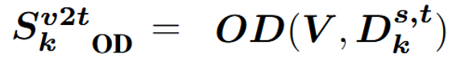
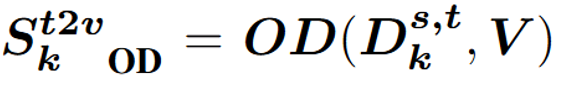
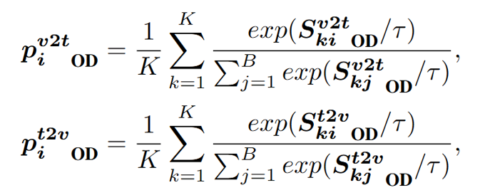
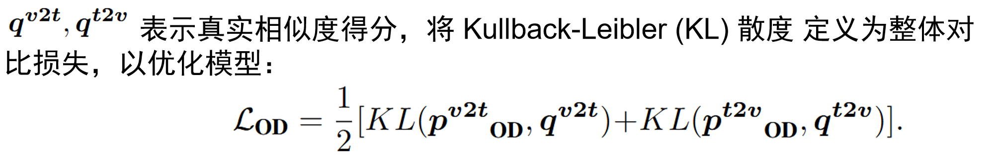

# OST: Refining Text Knowledge with Optimal Spatio-Temporal Descriptor for General Video Recognition
OST：利用最优时空方法改进文本知识 通用视频识别描述符

## Introduction

### Motivation ：

主流方案倾向于通过附加时序学习器来解决视觉差异，却忽略了描述性叙述与简洁类别名称之间的文本差异。

这种疏忽导致潜在空间的可分离性降低，可能阻碍视频识别性能。

 
### Sanity check on category names

1. 与 ImageNet 相比，K400 和 Sthv2 数据集的特征呈现更密集的聚类分布

        这从定性角度表明视频类别名称的语义区分度较低

2. 视频数据集的类别名称平均余弦相似度始终高于图像数据集

### Optimal Spatio-Temporal Descriptor (OST)

## Preliminaries
1. 最优运输的目标是在两个分布之间寻找成本最低的运输方案。本文仅考虑与我们的框架密切相关的离散分布。假设我们有两组离散经验分布：

2. 正则化的 OT 问题定义如下:

## Method

## Training Objectives

考虑到公式中 OD Solver 计算得到的整体 logits 可以描述为视频到文本的logits

对称的文本到视频的 logits 可以通过类似的方式获得

然后，softmax 归一化的相似度得分可以表示为：

# Conclusion

本文提出了一种新颖的通用视频识别流程 OST 。

我们利用逻辑逻辑模型（LLM）将类别名称扩展为时空描述符，并通过最优描述符求解器（Optimal Descriptor Solver） 优化语义信息。

在六个数据集和三个不同任务上的全面评估验证了我们方法的有效性。
