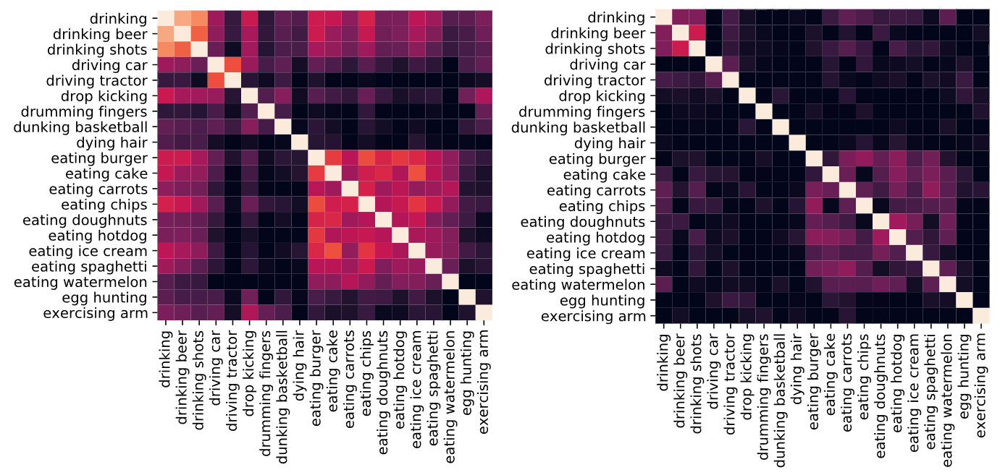
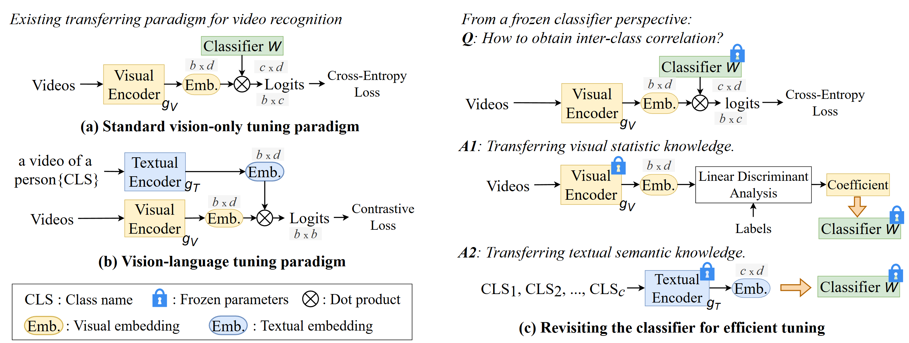

# Revisiting Classifier: Transferring Vision-Language Models for Video Recognition

借助文本编码器提高视觉语言预训练模型对下游分类任务的可迁移性。

CLIP 的文本编码器提取类标签的嵌入文本向量经过计算相似度之后可以得到这样的结果。

然后 使用CLIP 的视觉编码器 + d×c的矩阵，将该矩阵的 d 维列向量视为类别标签的嵌入，再计算相似度之后也会产生类似的效果，也显示出一定的相关性。

## Method

所以提出了两种构造这个矩阵的方法：

第一种是 线性判别分析，LDA会最大化类间协方差然后最小化类内协方差。

第二种就是 文本嵌入向量。  W,由类别标签的文本特征向量嵌入组成的。矩阵W的每行向量 ，是通过clip文本编码器对每个类别的标签编码得到的输出向量来初始化的。