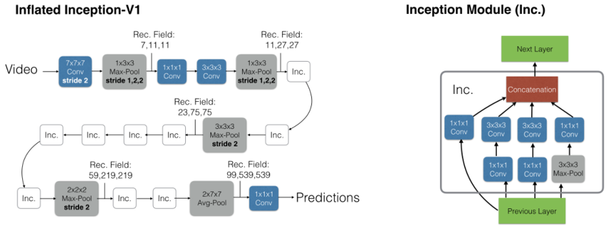
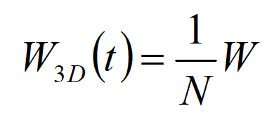

# Quo Vadis,Action Recognition? A New Model and the Kinetics Dataset
传统数据集（如UCF-101和HMDB-51）因规模较小，限制了深度学习模型的性能提升。为此，本文提出了一个大规模数据集——Kinetics，以及一种新型的双流膨胀3D卷积网络（I3D），以更好地捕捉视频的时空特征。

传统数据集（如UCF-101和HMDB-51）因规模较小，限制了深度学习模型的性能提升。为此，本文提出了一个大规模数据集——Kinetics，以及一种新型的双流膨胀3D卷积网络（I3D），以更好地捕捉视频的时空特征。

## Two-Stream Inflated 3D ConvNets
论文引入了Two-Stream Inflated 3D ConvNets（双流膨胀 3D 卷积网络，I3D）

基于 Inception-v1 的 I3D 模型在 Kinetics 上进行预训练后，获得的性能远远超过最先进的模型。

  

1. inflated操作：将2D卷积核和池化核膨胀为3D卷积核,复制 N 次得到 3D 卷积核，权重除以 N,这样能够实现如果输入的帧在时间上是一样的 
➜ 3D卷积输出 = 2D卷积输出

  

## 实验
除了C3D网络，所有的网络都使用了Imagenet预训练的Inception-v1，Inception-v1网络也做了一些改进，在每一个卷积层后边都添加了batch normalization 和relu。

