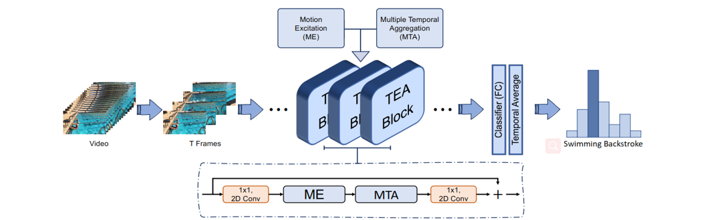
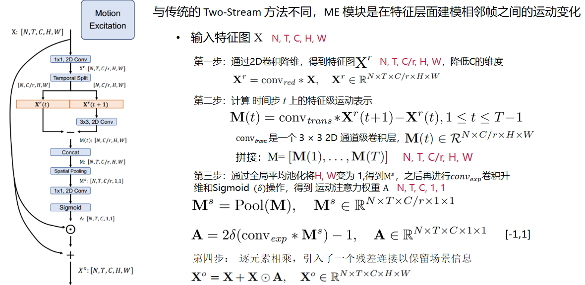
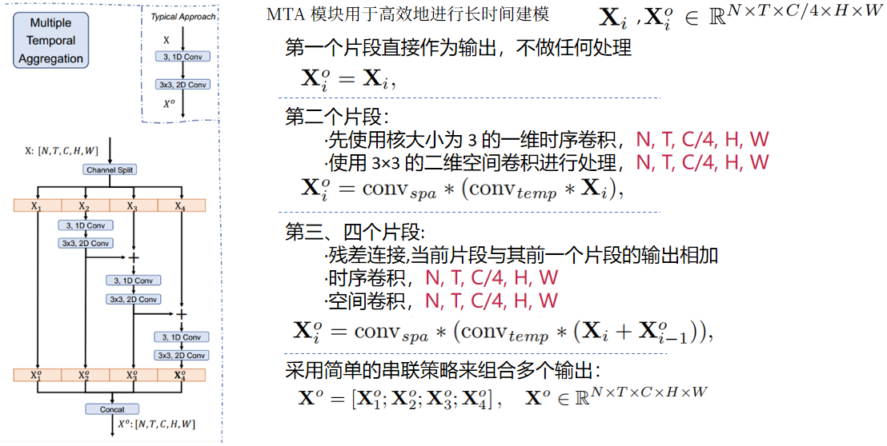
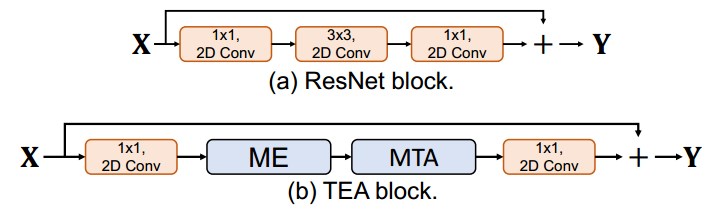
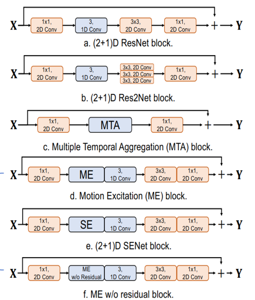
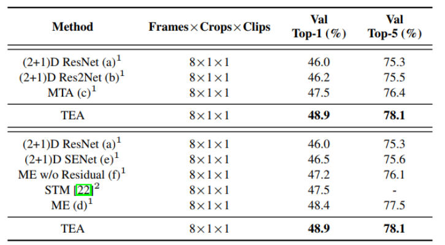
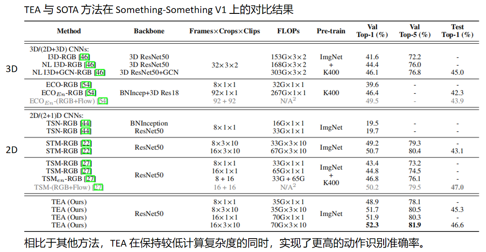
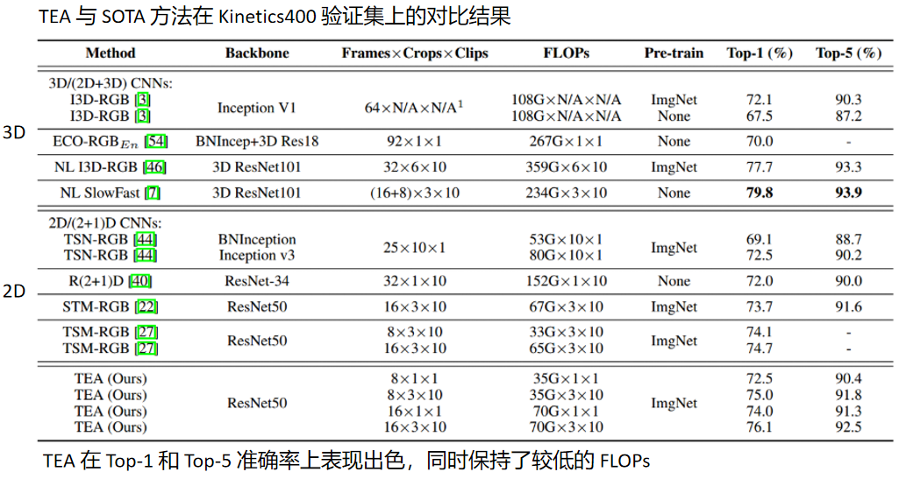
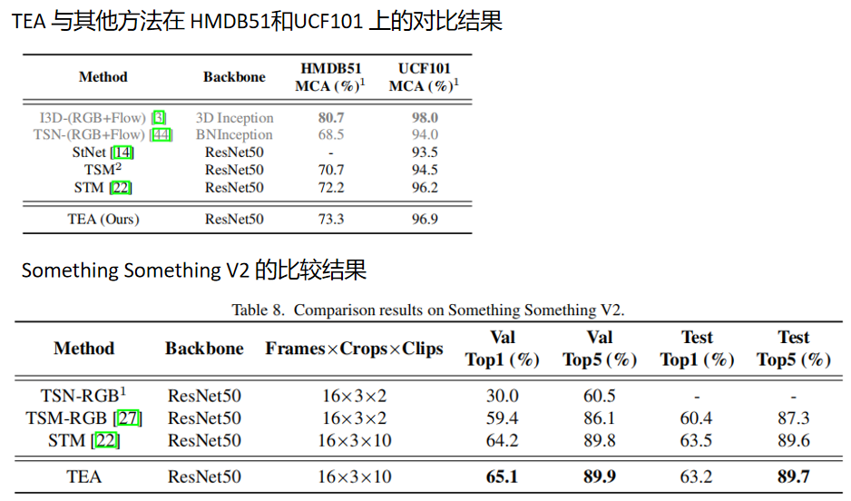

# TEA: Temporal Excitation and Aggregation for Action Recognition

《TEA: Temporal Excitation and Aggregation for Action Recognition》

  

它提出了一种高效的时序建模模块，用于视频中的动作识别任务。

在短时运动编码方面，大多数现有方法使用双流架构分别在各自的流中处理RGB图像和光流信息，
然而，光流的计算过程耗时较长且存储开销较大。

而且，空间和时间特征的学习过程是相互隔离的，仅在后期网络层进行融合。为了解决这些问题，论文提出了一种运动激励（ME）模块 ——将运动建模融入整个时空特征学习过程中。

为了解决长时序聚合的问题，
论文还引入了一个多重时间聚合（MTA）模块。

当时空特征经过该模块时，特征与邻近帧之间实现了多次信息交互

从而使得等效的时序感受野成倍增加，能够更有效地建模长时序动态关系。

# 贡献
1. 运动激励（ME）模块将短时间运动建模与整个时空特征学习方法相结合。

2. 多重时间聚合（MTA）模块可以有效地扩大时间感受野，以实现长距离时间建模。

3. 所提出的两个模块都是简单、轻量级的，并且可以很容易地集成到标准ResNet块中,以便进行有效和高效的时序建模。

# ME
与传统的 Two-Stream 方法不同，ME 模块是在特征层面建模相邻帧之间的运动变化

  

# MTA
MTA 模块用于高效地进行长程时间建模

它把输入特征在通道维度，分成四组

  

# 集成
最后就是集成在Resnet模块中
1. ME模块被集成到 ResNet 块的瓶颈层（bottleneck layer）(第一个 1 × 1 Conv 层)之后
2. MTA 模块被用来替换 ResNet 块中残差路径上的原始 3×3 卷积层

  

# 实验

消融实验：论文首先做了几个消融实验，以证明提出的 TEA 块中不同组件的有效性

  

1. 在第一个 2D 空间卷积之后插入一个 1D 通道时间卷积
2. 3×3 空间卷积变形为一组子卷积
3. 只有MTA
4. 与（2+1）D ResNet 基线相比，在路径中增加ME。
5. SE块取代了 ME 
6. 删除 ME 中的残差连接

结论：

  

MTA 基线的性能优于 （2+1）D ResNet 基线。

考虑到所提出的 MTA 模块同时扩大了空间和时间维度的感受野，因此要明确这两个方面各自的影响。

论文将 (2+1)D ResNet 基线模型与 (2+1)D Res2Net 基线模型进行了对比。

可以看出，这两个基线的准确率相近，且均低于 MTA 模型

说明：提升动作识别性能的关键在于——时间建模能力

为了证明上述性能提升并非由引入额外参数所带来的，论文将 SENet 模型与 ResNet 模型进行对比

可以看到， SENet 基线模型的性能与 ResNet 基线模型相近，说明：忽略时序建模难以提升性能。

将 ME 有无残差连接对比，说明残差连接对于ME来说是必要的

之后在Something-Something V1和Kinetics400上 与 SOTA 方法进行了对比。

相比于其他方法，TEA 在保持较低计算复杂度的同时，实现了更高的动作识别准确率，同时保持了较低的 浮点运算次数

在 UCF 和 HMDB 中 ，TEA 模型的性能优于除 I3D 之外的大多数现有方法

