# FineGym: A Hierarchical Video Dataset for Fine-grained Action Understanding

FineGym数据集，它一个基于体操视频的数据集

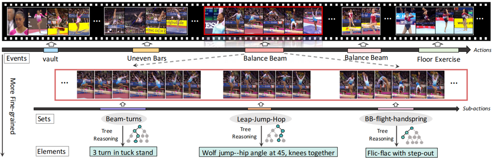

它提供了动作和子动作级别的时序标注，采用三级语义层次结构。

例如，一个“平衡木”事件将被标注为一组基本子动作序列，来源于五个集合,其中每个集合中的子动作将进一步用精细定义的类别标签进行标注。

在 FineGym 中，event 是最高级别的动作类别，代表着不同的体操项目。

一个 event 下会包含多个 set ，每个 set 表示这个体操项目中的一个完整的动作。

一个 set 由多个 element 组成，element 是最细粒度的动作。

FineGym具有以下显著特点：
1）多级语义层次结构。所有动作都以三个语义级别进行标注，分别是 event（事件）、set（集合）、element（元素）。这种语义层次结构为粗粒度和细粒度动作理解提供了坚实的基础。

2）时序结构。每个视频中所有重点关注的动作实例都被明确标注，并且被人工分解为子动作。这些标注的时序结构为细粒度理解提供了重要支持。

3）高质量。数据集中的所有视频均为高级别专业比赛的高分辨率记录。

论文借助 FineGym，进行了一系列实验，发现在细粒度动作识别中：

1）稀疏采样的帧不足以完整表达动作实例。

2）相比视觉外观，运动信息起着显著更重要的作用。

3）对时序动态的正确建模至关重要。

4）在粗粒度动作识别数据集上进行预训练并不总是有利的。

这些观察结果清楚地显示了粗粒度和细粒度动作识别之间的差距。

# 贡献

1）开发了一个用于细粒度动作理解的新数据集 FineGym，它提供了高质量且细粒度的标注。特别是，这些标注包含三个语义层级（event、set、element）和两个时间层级（action 和 sub-action）。

2）基于 FineGym 进行了深入研究，揭示了细粒度场景下出现的关键挑战，这些发现有望为未来的研究指明新的方向。

# The FineGym Dataset

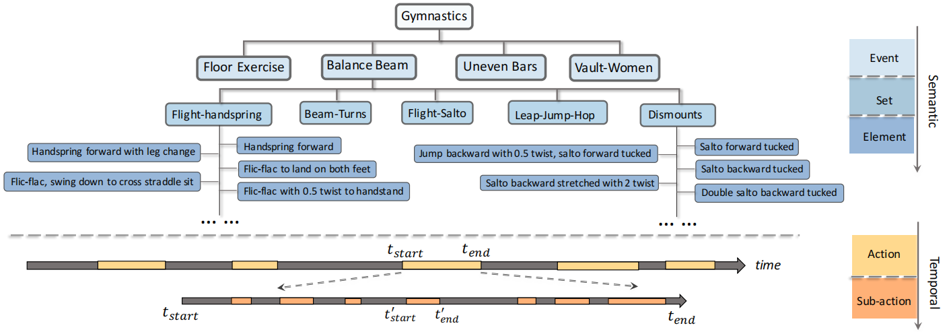

这张图是FineGym 对语义和时间标注进行了分层组织。

上半部分展示了三个层级的类别标签，分别是事件（例如平衡木）、集合（例如下法）和元素（例如前屈体空翻）。

下半部分描绘了两级时间标注，即动作的时间边界（顶部条形图）和子动作实例的时间边界（底部条形图）。    

从event 到 element，逐渐提高动作的粒度。

# Dataset Construction
它从体操赛事中挑选了 4 个 event 下的 15 个 set，因为这些 set 提供了更具区分性的 element 级类别

这个数据集的构建方式是通过设计一棵决策树，让标注者沿着一系列清晰的问题来进行推断，最终确定动作的具体类别和难度值。

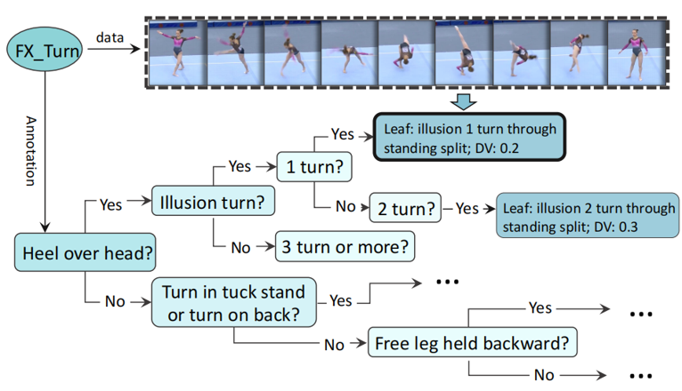

# Dataset Statistics

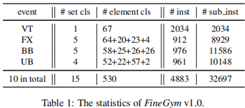

这个数据集收集了体操领域10种不同的 event （男子六种+女子四种）。

从中选择了 4 个女子 event 来提供更细粒度的标注，有着15个set。

在定义的 530 个 element 中，有354个至少有一个实例。

在时间上，这些标注的 sub-action（子动作） 通常都 短于 2 秒，符合进行更细粒度信息学习的需求。

# Dataset Properties 数据集属性
1. 高质量：FineGym 中的视频都是顶级比赛的官方录像，动作专业且标准，大多数都是高分辨率(720P 和 1080P)

2. 丰富性与多样性:时域方面，FineGym具有两层结构，而类别语义的层级则有三层

3. 完全以人体动作为中心:背景有很强的相似和一致性，研究的关注点完全放在视频中的运动员身上

4. 元素类别的决策树：从根节点到叶子节点的路径还原了整个分类过程，并且记录了某一类运动最显著的属性标签集合。同时，在叶子节点中，每一个类别的动作还标注了其难度分数，可用于动作难度评估的研究。

# Event-/Set-level Action Recognition

论文在较粗糙粒度上（event&set），进行了相关实验和分析。

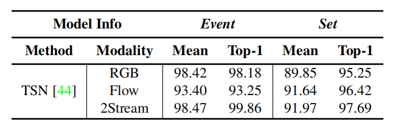

这是 TSN 在粗粒度的动作识别方面的结果。

可以看到在最粗粒度的(event)识别中，外观特征的贡献超过了Flow(光流)特征，并且准确率已经趋于饱和。

在更细的粒度(set)，光流特征的作用更好。

这说明更细粒度的动作识别需要模型的关注点逐渐回到动作本身，而不能通过仅仅学习一些场景和物体信息就能很好地对动作进行分类.

# Element-level Action Recognition

论文在element进行了实验。

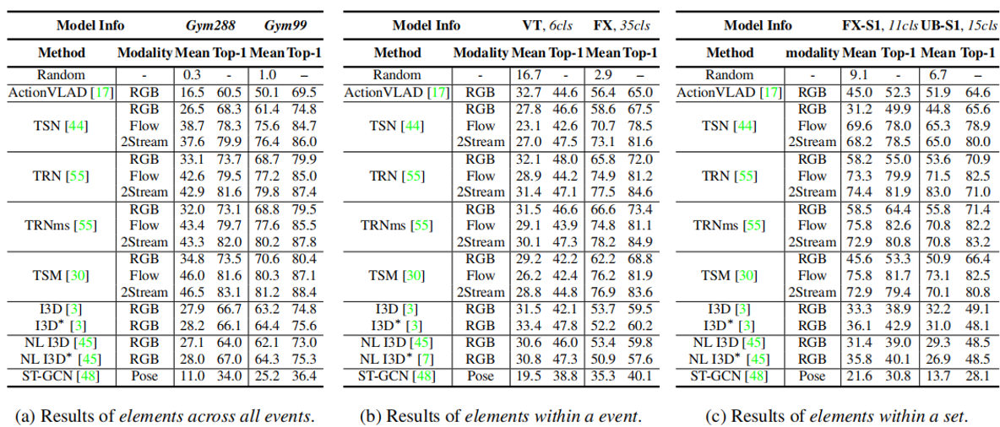

对2D+1D模型、基于3D卷积核的方法、人体关键点的识别方法进行了实验。

1. 以 RGB 值形式表示的视觉外观特征 在细粒度动作识别中的作用显著小于在粗粒度动作识别中的作用。而在大多数情况运动特征 （如光流）起到了更重要的作用。
2. TRN 和 TSM 在性能上优于 TSN，所以捕捉时序动态非常重要。
3. 在 ImageNet 和 Kinetics 上预训练的 I3D 与 2D-CNN 方法取得了相似的结果，这可能是因为 FineGym 中元素类别的时序模式与 Kinetics 数据集中的模式存在较大差异。
4. 基于骨架信息的 ST-GCN 表现不佳，这是因为在体操视频中进行骨架估计面临较大挑战

除了动作识别，文中还选取动作时域检测的方法——SSN，在动作和子动作两个不同的粒度上进行了实验。

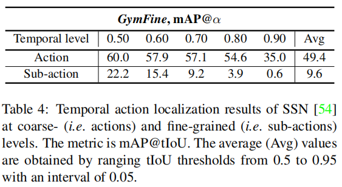

实验结果表明，在细粒度的子动作级别上，SSN 的 mAP 值显著下降，表明 SSN 在捕捉更精细的动作边界时存在较大挑战。

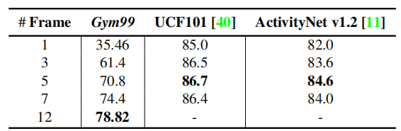

在对TSN的实验中，增加采样帧数能够提高的 TSN 性能，说明：

进行细粒度动作识别时，每一帧都对性能有重要贡献 ，稀疏采样难以满足需求。

这体现了FineGym细粒度动作数据的信息丰富性。

# Analysis

论文提出在以往的视频动作数据集上，时域信息的效用并没有得到非常明显的体现。

但是在FineGym上，对时域动态信息的整合和利用就显得十分重要。

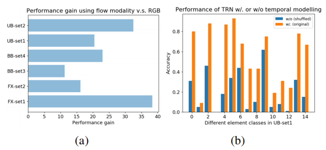
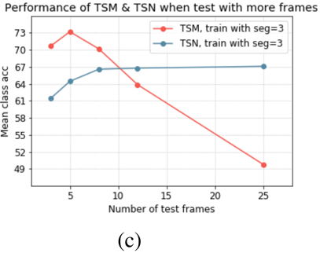        
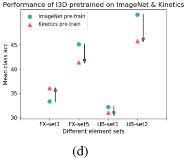

abc三个不同的实验分析证明了这一观点：

1. a 对TSN而言，在给定不同的组类别进行元素类别识别时，光流信息相比于RGB特征对结果贡献显著更多。

2. b TRN学习了帧间关系来建模时域信息，然而一旦将输入的帧的顺序打乱，TRN 的表现将大幅下降。

3. 对于 TSM 中的时间位移模块 ，采用了使用 3 帧输入训练一个 TSM 模型 的实验方法，然后在测试阶段逐步增加输入帧的数量。将 TSN 作为对比，图 (c) 中

可以看到：

对于没有时域建模的TSN来讲，当测试的帧数逐渐超过训练帧数，识别的表现会因为引入新信息而变好并饱和。

而对于在模型设计中嵌入了时域建模的TSM来说，当测试帧数和训练帧数的差异过大，学到的时域模型不再适用，识别准确率大幅下降。

4. 通常进行预训练能够大幅提升模型的识别准确率。但在 FineGym 上，这种预训练方案并不总是有效，可能的原因是粗粒度动作和细粒度动作之间在时序模式上有较大的差异。

# Potential Applications and Discussion
最后提出了一些问题。

1. 密集、快速的动作
2. 细微的空间语义
3. 复杂的时序动态 
4. 推理能力，例如计算跳跃次数

# Conclusion
提出了一个专注于体操视频的数据集 FineGym ，包括高质量且以动作为中心的数据、语义和时间维度上多粒度的一致性标注，以及多样和信息丰富的动作实例。

