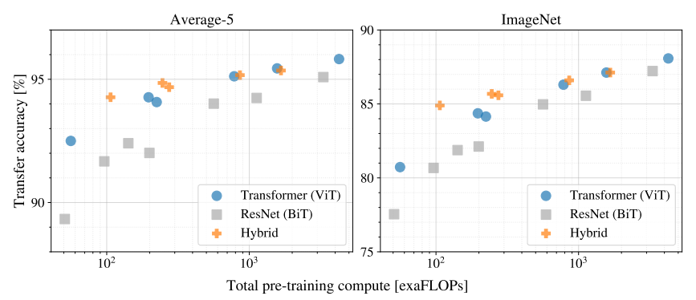

# An Image is Worth 16x16 Words: Transformers for Image Recognition at Scale
Transformer，已成为自然语言处理（NLP）中的首选模型。主要方法是先在大规模文本语料库上进行预训练，然后在较小的特定任务数据集上进行微调。

受NLP中 Transformer 扩展成功的启发，论文尝试直接将标准 Transformer 应用于图像，并尽可能少地进行修改。为此，论文将图像分割成块（patch），并将这些块的线性嵌入序列作为输入提供给 Transformer。图像块 (patches) 的处理方式同 NLP 的标记 (tokens)

Transformers 缺乏 CNN 固有的一些归纳偏置 (inductive biases) —— 如 平移等变性 和 局部性 (translation equivariance and locality)，因此在数据量不足时，因此在数据量不足时泛化能力不佳。 

# Contribution
1. 首次成功将标准 Transformer 应用于图像分类任务

    不依赖卷积或图像特定的归纳偏置（如平移不变性、局部性），只在输入阶段将图像切分为 patch，并作为 token 输入 Transformer。

2. 证明了在大规模数据集上预训练，ViT 可媲美甚至超越 CNN 的性能
3. 展示了 Transformer 在图像分类中具备良好的扩展性
随着模型规模和预训练数据规模增加，ViT 的性能持续提升，未表现出明显的饱和趋势
4. 在相似计算预算下，ViT 通常比 CNN 效率更高

# Method
在模型设计中，论文尽可能地遵循原始Transformer。

这种优势在于，可扩展的NLP Transformer架构及其高效实现可以直接使用。

ViT将输入图片分为多个patch（16x16），再将每个patch投影为固定长度的向量送入Transformer，后续encoder的操作和原始Transformer中完全相同。但是因为对图片分类，因此在输入序列中加入一个特殊的token，该token对应的输出即为最后的类别预测

## 图像块嵌入 (Patch Embeddings)

将图像切成小块（patch），每个小块拉平成一维向量后，通过一个 线性变换 投影到固定维度的向量空间中。

例如输入图片大小为224x224，将图片分为固定大小的patch。

patch大小为16x16，则每张图像会生成224x224/16x16=196个patch。

即输入序列长度为196，每个patch维度16x16x3=768。

线性投射层：通过一个线性投影，得到一个 D 维向量

因此输入通过线性投射层之后的维度依然为196x768，即一共有196个token，每个token的维度是768

之后，嵌入块序列前添加一个可学习的向量 X_class ，用来做分类

最后就形成了 197 个 768 维的向量。

## positional encoding（standard learnable 1D position embeddings）
在Vision Transformer 中，为了保留图像块之间的位置信息，需要加入位置编码。

它每个位置添加了一维位置嵌入，位置嵌入是可学习的参数，模型会在训练过程中自动学习如何最好地编码位置信息。

这个图展示了模型学会了在位置嵌入的相似性中编码图像内的距离，即较近的patch往往具有更相似的位置嵌入。

这说明：

1. 空间上相邻的patch确实具有更相似的位置编码，这说明模型自动学会了空间邻近性
2. 明显的行列结构，说明模型理解了图像的2D网格布局
3. 在大尺寸图像上甚至出现了类似正弦函数的周期性模式。

这些发现证明了可学习的位置嵌入足够强大，能够自动捕捉2D图像的拓扑结构，因此不需要2D位置编码方案。

这个表也显示出：无位置嵌入的模型与位置嵌入模型的性能之间存在较大差距，但不同编码位置信息的方法之间差异不大。

## Transformer Encoder
Transformer Encoder 由 多头自注意力 和 MLP 块 交替层组成。在每个模块之前应用层归一化（LN），在每个模块之后应用残差连接。

从这个公式看出，先对输入进行层归一化，然后通过多头自注意力或MLP，最后加上残差连接。

## MLP Head
最后是MLP Head，用于将Transformer输出的 [Class] token向量映射到具体的分类任务标签上。

# 实验
采用了三种模型变体进行了实验：“Base”、“Large”和“Huge”模型。

然后是和sota方法对比。发现Vision Transformer模型在所有数据集上都优于基于ResNet的基线

较小的ViT-L/16模型在所有任务上都优于BiT-L，而且需要的训练计算资源更少

更大的模型ViT-H/14性能更强，而且它的计算量仍然大幅少于之前的最先进方法。

# 
这张图展示了 ViT-H/14 与其他几种最先进的方法在 VTAB 上的表现对比

ViT-H/14在Natural和Structured任务上优于BiT和其他方法。在Specialized任务上，前两个模型的性能相似。

## Transfer to ImageNet

Vision Transformer在大型JFT-300M数据集上预训练时表现良好。与ResNet相比，它对视觉的归纳偏置更少，那么数据集大小有多关键？论文进行了两系列实验

当在最小的数据集ImageNet上预训练时，ViT-Large模型的表现仍不如ViT-Base模型。

使用ImageNet-21k预训练时，它们的性能相似

使用JFT-300M时，huge模型效果最好

## Linear few-shot evaluation on ImageNet versus pre-training size

这个图展示了在JFT-300M数据集的随机子集上训练模型。

可以看出，在小规模数据集上，与 ResNet 相比，ViT 更容易过拟合。

ViT-B/32但在 9Million 数据集上表现明显更差，而在 90M 及以上数据集上则表现更好

这一结果强化了这样一种直觉：卷积归纳偏置对于较小的数据集是有用的，但对于较大的数据集，直接从数据中学习相关模式是足够的，甚至是有益的

## 不同架构的性能与预训练计算量对比
最后就是不同架构的性能与预训练计算量对比

1. ViT 在性能与计算开销的权衡上全面优于 ResNet

2. 在计算预算较小时，混合结构（Hybrid）模型略优于纯ViT，但随着模型变大，这种优势会逐渐消失

3. ViT 在当前尝试的规模范围内尚未出现性能饱和，说明其未来还有进一步扩展和提升的潜力。

# Conclusion
ViT 抛弃了传统 CNN 的结构偏置，仅用标准 Transformer 就能在大规模预训练下取得 SOTA 性能

探索了将 Transformer 直接应用于图像识别的可能性。与以往在计算机视觉中使用自注意力机制的方法不同，我们没有在模型结构中引入图像特有的归纳偏置（除了最开始的图像划分为 patch 的操作）。

相反，我们将图像看作一个由 patch 组成的序列，然后直接使用 NLP 中标准的 Transformer 编码器进行处理。这种简单但具有可扩展性的方法，在结合大规模预训练数据时，效果出人意料地好。

因此，Vision Transformer 在多个图像分类数据集上达到了或超过了当前最先进的方法（SOTA），同时预训练成本相对较低。
