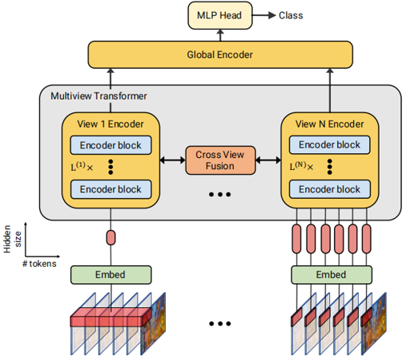

# Multiview Transformers for Video Recognition

## Introduction

在图像领域，多尺度处理通常使用金字塔进行，因为自然图像的统计特性是各向同性的且具有平移不变性。

在构建金字塔结构时，由于池化或下采样操作，时空信息会部分丢失。例如，在构建 SlowFast  中的 “Slow” 分支时，通过对帧进行下采样，会导致时间信息的丢失。

论文提出了一种简单的基于 Transformer 的模型，不依赖于金字塔结构或对输入进行下采样来捕捉多尺度的时间上下文。

方法是利用视频输入的多种表示形式。如图所示，从输入视频中以多个不同的时间长度提取 token。

1. 从较长时间间隔中提取的 token 可以捕捉场景的大致内容
2. 而从较短片段中提取的 token 则能捕捉到细粒度的细节

该模型由多个专门针对每个“视图”的独立 Transformer 编码器组成，并通过横向连接在不同视角之间融合信息。

1. 对于表示视频整体内容的广泛视图，用较小的编码器效果更好。
2. 而用于捕捉细节的视图，使用容量更大的编码器。

## Multiview tokenization
方法的第一步是进行 Multiview Tokenization，也就是将同一个视频从多个不同的“视图”（views）进行分割与编码。

这里的“视图”指的是：我们用不同尺度的 tubelet 去切分视频。这些 tubelet 是固定大小的三维小块，包含时间和空间维度的信息。

通过 3D 卷积核将视频分段为固定大小的 tublets，生成标记，较大视图对应较少标记，捕捉慢变化语义，较小视图对应较多标记，捕捉精细运动。每个视图使用不同大小的卷积核和不同的隐层维度。

## Multiview transformer-Multiview Encoder
首先，将所有初始 token 拼接在一起，得到完整的 token 序列。

但由于自注意力机制的计算复杂度是平方级的，所以不能直接将所有视角的 token 一起送入同一个 Transformer。

为此，为每个视角都设计了一个独立的 Transformer 编码器，每个编码器可以有不同的层数、参数配置。这些编码器之间不是孤立的，在它们之间加入了“横向连接”（lateral connections），用于跨视角的信息传递。

每一层 Transformer 都是基于原始 Transformer 结构设计的，唯一的区别是可以在每一层中加入 跨视角融合操作。

在完成每个视角内的处理之后，从每个视角中提取最终的 token 表示，然后将这些表示拼接起来，再送入一个 global encoder 中统一处理，最后得到用于分类的最终输出 token。

## Multiview transformer-Cross-view fusion
论文考虑三种跨视图融合方法

### 第一种是cross view attention
方法是顺序融合所有相邻视图对 i 和 i + 1 之间的信息，其中视图按标记数量递增的顺序排列（即 N^(i) ≤ N^(i+1)）。

具体来说，为了更新较大视图 z^(i+1) 中的标记，我们计算注意力，其中查询是 z^(i+1)，而键和值是 z^(i)（来自较小视图的标记）。由于两个视图之间的标记隐藏维度可能不同，首先将键和值投影到相同的维度。

### 第二种是瓶颈 Token 融合

在 token 多的视角（细粒度）中，插入一组“瓶颈 token”。

这些瓶颈 token 会与该视角的所有 token 一起参与自注意力计算，因此它们能捕捉这个视角中的“摘要信息”。

然后将这些瓶颈 token 线性变换后，插入到 token 少的视角（粗粒度）中，作为额外输入，再次做 self-attention 计算。

该过程在每一对相邻视角之间重复进行。这允许 token 数量最少的视图聚合来自所有后续视图的细粒度信息。

### 第三种是MLP fusion
这种方法是在每个编码器层的 MLP 块之前进行融合。
具体来说，来自视图 i + 1 的标记与视图 i 的标记沿着隐藏维度进行拼接。这些标记随后被输入到层 i 的 MLP 块中。

## 实验

对于每个视图的主干网络，考虑了五种 ViT 变体，分别是“Tiny”、“Small”、“Base”、“Large”和“Huge”。

这个是 MTV 每个视角的模型配置

#

### Model-view assignments  模型-视图分配
有两种：

1. 对于较大的视图使用更大的模型
2. 对于较小的视图使用更小的模型

表 (a)表明，将较大模型分配给较小视图更优。
例如，B/2+S/4+Ti/8 的准确率为81.8%，而 B/8+S/4+Ti/2 的准确率仅为78.5%。

另一种策略是为所有视图分配相同的模型。
表1(b)表明，在这三个例子中，较大视图中将“Base”换为“Small”或“Tiny”准确率几乎没有差异。

这说明，可以在不损失准确率的情况下，降低模型的复杂性

# 

### 哪种跨视图融合方法最好
然后实验探究了哪种跨视图融合方法最好。

表c展示了在三视图模型上不同融合方法的比较。

使用晚期融合（late fusion）和集成（ensemble）作为基线方法。

集成方法是，直接对每个视角输出的概率进行相加。
各视角模型是分别独立训练的。这种方法的整体性能甚至不如单一base模型

晚期融合方法：是将每个视角 transformer 编码器输出的最终嵌入向量直接拼接起来，再输入全局编码器（global encoder），中间不进行任何跨视角信息交互。

这个方法能提高 base 模型的准确率。

除了MLP融合外，所有融合方法都优于基线，而CVA（Cross-View Attention）总体表现最佳。

#

### Effect of the number of views & Which layers to apply cross-view fusion?

接下来研究了 view 的数量的影响
表 1(f)展示了随着视角数量的增加，在 Kinetics-400 上的性能表现。

可以看到，增加视图数量能够提高准确率。

然后这个是研究 应该在哪些层进行融合？
实验将融合方法固定为CVA，并使用三视图模型，在表 f 中调整跨视图融合的位置和层数。

当使用一层融合时，最佳的融合位置是中期

结合中期和晚期的融合可以改善性能，在第 5 层和第 11 层进行融合获得了最佳结果

#

### Accuracy/computation trade-offs
准确度/计算量权衡

图(a)显示，MTV 始终表现更好，并且在不同模型尺度上实现更高精度所需的 FLOPs 少于 ViViT-FE。

图(b)显示，MTV 在所有模型尺度上都可以比 ViVIT-FE 具有更高的吞吐量，同时仍然提高其精度。

#

### Comparison to the state of the art
在六个不同的数据集上与当前最优方法进行了比较

在表的 第一部分 将我们的方法与在 ImageNet-1K 、ImageNet-21K 上预训练的方法以及完全未使用预训练的方法进行了比较。

第二部分，我们将我们的方法与在 Instagram 65M 、JFT-300M 、JFT-3B 、WTS 、Florence 或 HowTo100M 等网络规模数据集上预训练的方法进行了比较。

都取得了最先进的结果

